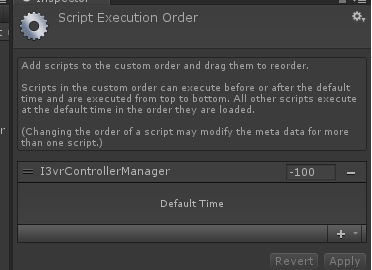
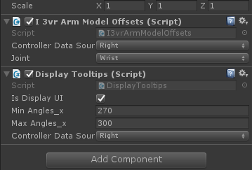

**广州新维感3i VR手柄SDK API使用说明**
=====================================

[1 概述](#概述)

[2 Unity3D入门](#unity3d入门)

　[2.1 先决条件](#先决条件)

　[2.2 导入SDK](#导入sdk)

　[2.3 启用I3vr控制器和UI的支持](#启用i3vr控制器和ui的支持)

　[2.4 示例场景](#示例场景)

　[2.5 发布设置](#发布设置)

　[2.6 3iVR控制器支持](#ivr控制器支持)

　　[2.6.1 Arm Model](#arm-model)

　　[2.6.2 Input System](#input-system)

　　[2.6.3 Laser and reticle visualization](#laser-and-reticle-visualization)

　　[2.6.4 Controller Visualization](#controller-visualization)

[3 API参考](#api参考)

　[3.1 I3vrController](#i3vrcontroller)

　[3.2 I3vrArmModel](#i3vrarmmodel)

　[3.3 I3vrArmModelOffsets](#i3vrarmmodeloffsets)

　[3.4 I3vrLaserPointer](#i3vrlaserpointer)

　[3.5 I3vrControllerManager](#i3vrcontrollermanager)

[4 Appendices](#appendices)

概述
====

新维感3iVR手柄SDK支持Android平台，包括Daydream和Cardboard平台。通过手柄可以获取手柄位置，选取，简化手柄位置、姿态和状态的控制，以及头显的控制。3iVR
Unity
SDK包括手柄相关的支持、应用和示例程序。通过该使用说明可以方便开发人员创建基于3iVR手柄的应用程序。简化他们的VR开发，比如：

1.  头显回中

2.  手柄追踪

3.  手柄姿态

4.  用户输入事件处理

我们将3iVR SDK开源，方便和鼓励开发人员开发基于该手柄的应用。

Unity3D入门
===========

Unity3D使得开发人员开发VR应用变得简单。该指南将指导设置Unity开发3iVR控制器应用，以及创建一个demo场景。

Unity对VR开发的支持可以方便我们：

1.  从新开始一个Unity VR项目

2.  移植现有Unity 3D应用到VR

3.  方便在VR模式和非VR模式之间的切换

3iVR SDK方便我们：

1.  用户头部追踪

2.  检测用户与系统之间的交互（通过触发器或者控制器）

3.  自动修正手柄位置误差

先决条件
--------

需要Unity 5.4.5及以上版本。在安装Unity时确认已经选取"Android Build
Support"组件（默认是已经选取）。如果这是首次在Unity下开发Android应用，请按照官方指南设置Unity的Android
SDK（<https://docs.unity3d.com/Manual/android-sdksetup.html>）。

下载3iVR SDK for
Unity（https://github.com/3ivr/3ivr-unity-sdk）。包括SDK和demo程序。

当然你还需要Android手机和3i手柄。

导入SDK
-------

1.  打开Unity 5.4.5或以上版本,创建或打开一个工程项目。

2.  找到选项Assets \> Import Package \> Custom
    Package。打开并 选中3ivrSdkForUnity文件，检查导入资源包内所有资源是否选中，然后单击Import。如果出现提示，请接受升级。

启用I3vr控制器和UI的支持
------------------------

1.  创建一个空物体，并命名为I3vrControllerManger。

2.  在Project面板内搜索I3vrControllerManager类，在Inspector面板点选Execution
    Order拖入该类

1.  挂载I3vrControllerManager类，并设置Controller Type。

2.  添加Assets
    \>I3VRSDK\>Prefabs下I3vrRightControllerMain到场景内(双手柄模式下还需添加I3vrLeftControllerMain)。

3.  添加Assets
    \>I3VRSDK\>Prefabs下I3vrRightControllerPointer到场景内(双手柄模式下还需添加I3vrLeftControllerPointer)，并确保Transform组件Position和MainCamera
    Position数值一致。

4.  根据需求设置手柄数据来源。

1.  添加Assets \>I3VRSDK\>Prefabs下I3vrCanvas到场景内。

2.  添加Assets \>I3VRSDK\>Prefabs下I3vrEventSystem到场景内。

3.  保存场景。

示例场景
--------

1.  Assets\>I3VRSDK\>Scene\>Main.unity

2.  按钮状态显示，触摸点触点位置，触摸板手势触发。

3.  按钮检测到ButtonDown切换绿色，检测到ButtonUp切换红色。

4.  触摸点检测到TouchDown，显示绿点，并显示对应的触点位置。检测到TouchUp时隐藏。

5.  触摸手势触发会显示对应手势箭头(左划，右划，上划，下划，在显示0.1S后隐藏)。

6.  手柄实时姿态展示。

7.  Rotation，Gyro，Accele，Touch Pos，Frame对应API读数显示。

8.  Assets\>I3VRSDK\>Scene\>TestButton.unity

9.  UGUI-Button触发展示。

10. Arm Model 手臂模型展示。

11. 激光光标与按钮提醒展示。

发布设置
--------

1.  找到选项File\>Build
    Settings，将场景添加到场景列表，并确认为首个启动的场景，将发布平台选择为Android平台，并点击Switch
    PImport，确认Unity图标在对应Android平台。

2.  选中Player settings，找到Other Settings并执行以下操作。

3.  Bundle Identifier 输入包名(例如com.i3vr.UnityDemo)。

4.  Minimum API Level 设置为Android 5.0“Lollipop”(API LEVEL 21)或以上。

3iVR控制器支持
--------------

1.  Arm Model：使得VR中的控制器模型接近于I3vr控制器物理位置的数学模型。

2.  Input
    System：控制器模型射线交互模块,包含输入模块和接收模块,使得更好的通过手柄与UI或其他对象进行交互。

3.  Controller visualization：I3vr控制器的3D模型,按钮提醒,触摸板触点可视化。

4.  Laser and reticle visualization：显示激光笔和光标,试用户轻松的和VR环境交互。

### Arm Model

提供了一个手臂模型，一个使用物理控制器的方向和位置的数学模型，并且预测肩部，肘部，手腕和指针的位置，以确定在场景中放置控制器模型的位置。手臂模型通过I3vrArmModel脚本进行控制，该脚本附加到提供的预制I3vrControllerMain。

该I3vrArmModel脚本允许您调整以下属性：

1.  添加肘部高度：增加了一个偏移量来预测肘部的高度。

2.  添加肘部深度：增加一个偏移量预测肘部深度。

3.  指针倾斜角度：相对于控制器的指针向下倾斜的角度。对于和眼睛水平的物体进行交互时，15°的默认值是比较舒适的。如果用户需要与显着高于或低于对象的对象进行交互，则可能需要调整此属性。

4.  脸部淡出距离：控制器与脸部之间的距离，此后α值降低。

5.  追随目光：确定肩膀是否应该跟随用户的目光。

6.  使用加速度计：关闭加速器使控制器感觉更准确和可预测。打开它减少精度，但可以使用户感觉更像是持有一个真正的对象。

### Input System

要想使用此系统，请添加预制体I3vrEventSystem到场景中，你可以通过I3vrPointerInputModule脚本来配置输入系统。

### Laser and reticle visualization

预制体I3vrControllerPointer下Laser挂载I3vrLaserPointer脚本控制着激光可视化和显示光标。该脚本具有以下设置：

1.  激光颜色：确定激光的颜色。

2.  最大激光距离：当您目前没有指向物体时，激光显示的最大距离（以米为单位）。

3.  最大刻线距离：当您目前未指向对象时，这是激光光标显示的最大距离（以米为单位）。

### Controller Visualization

预制体I3vrControllerPointer下I3vrController对象下挂载的DisplayTooltips脚本控制触点可视化和按钮提醒UI,有如下设置：

1.  是否显示提醒UI。

2.  X轴最小显示角度：大于该值小于最大角度时显示UI，为顺时针旋转值。

3.  X轴最大显示角度：小于该值大于最小角度时显示UI该值为顺时针旋转值。

API参考
=======

I3vrController
--------------

**Summary:**

3iVR controller API的主入口。

为了使用API，增加这个对象到你场景中的GameObject中，或者使用I3vrControllerMain预制体。

为了存取控制器的状态，简单读取该类的属性。

**Inheritance:**

Inherits from: MonoBehaviour

**Events:**

| OnControllerUpdate | OnControllerUpdateEvent |
|--------------------|-------------------------|
| HeadsetRecenter    | OnHeadsetRecenter       |

**Properties:**

| ArmModel          | I3vrArmModel 返回手臂与控制器关联模型实例。                                                                                                                                     |
|-------------------|---------------------------------------------------------------------------------------------------------------------------------------------------------------------------------|
| ConnectionState   | I3vrConnectionState 返回当前控制器连接状态。                                                                                                                                    |
| ApiStatus         | I3vrControllerApiStatus 返回当前控制器API状态。                                                                                                                                 |
| Orientation       | Quaternion 表示方向的为Unity坐标系，X指向右侧，Y指向上，Z指向前方。因此，要使场景中的对象与控制器具有相同的方向，只需将该四元数赋值到GameObject的transform.rotation。           |
| Gyro              | Vector3 返回控制器的陀螺仪读数。 陀螺仪表示其每个局部坐标的角度。控制器的轴是：X指向右侧，Y指向上，Z指向前方。角速度单位为弧度/秒。                                             |
| Accel             | Vector3 返回控制器的加速度计读数。 加速度计表示加速度和重力在每个控制器局部坐标的方向上的影响。控制器的局部坐标为：X指向右侧，Y指向上，Z指向前方。加速度以米/秒为单位进行测量。 |
| IsTouching        | bool 如果为Ture，则用户正在触摸。                                                                                                                                               |
| TouchDown         | bool 如果为Ture，则用户刚触摸。 这是一个事件标志：事件发生后只有一帧是true。                                                                                                    |
| TouchUp           | bool 如果为Ture，则用户刚停止触摸。 这是一个事件标志：事件发生后只有一帧是true。                                                                                                |
| TouchPos          | Vector2 返回触摸板触点读数。原点位于矩形左上角(0，0)，右下角为(1，1)。                                                                                                          |
| Recentered        | bool 如果是true，则用户刚刚完成了手柄回中。                                                                                                                                     |
| TriggerButton     | bool 如果是true，则用户按下了Trigger键。                                                                                                                                        |
| TriggerButtonDown | bool 如果是true，则用户刚按下了Trigger键。 这是一个事件标志：事件发生后只有一帧是true。                                                                                         |
| TriggerButtonUp   | bool 如果是true，则用户弹起了Trigger键。 这是一个事件标志：事件发生后只有一帧是true。                                                                                           |
| AppButton         | bool 如果是true，则用户按下了App键。                                                                                                                                            |
| AppButtonDown     | bool 如果是true，则用户刚按下了App键。 这是一个事件标志：事件发生后只有一帧是true。                                                                                             |
| AppButtonUp       | bool 如果是true，则用户弹起了App键。 这是一个事件标志：事件发生后只有一帧是true。                                                                                               |
| HomeButton        | bool 如果是true，则用户按下了Home键。                                                                                                                                           |
| HomeButtonDown    | bool 如果是true，则用户刚按下了Home键。 这是一个事件标志：事件发生后只有一帧是true。                                                                                            |
| HomeButtonUp      | bool 如果是true，则用户弹起了Home键。 这是一个事件标志：事件发生后只有一帧是true。                                                                                              |
| SwitchButton      | bool 如果是true，则用户按下了Switch键。                                                                                                                                         |
| SwitchButtonDown  | bool 如果是true，则用户刚按下了Switch键。 这是一个事件标志：事件发生后只有一帧是true。                                                                                          |
| SwitchButtonUp    | bool 如果是true，则用户弹起了Switch键。 这是一个事件标志：事件发生后只有一帧是true。                                                                                            |
| TouchGestureLeft  | bool 如果是true，则用户触发了左划手势。                                                                                                                                         |
| TouchGestureRight | bool 如果是true，则用户触发了右划手势。                                                                                                                                         |
| TouchGestureUp    | bool 如果是true，则用户触发了上划手势。                                                                                                                                         |
| TouchGestureDown  | bool 如果是true，则用户触发了下划手势。                                                                                                                                         |
| ErrorDetails      | string 如果State == I3vrConnectionState.Error，则包含有关错误的详细信息。                                                                                                       |

I3vrArmModel
------------

**Summary:**

I3vrArmModel是控制器和场景之间的标准接口，其主要负责：

-   检测手柄的方向和位置

-   预测肩膀、肘部、手腕和指针的位置

**Inheritance:**

Inherits from: MonoBehaviour

**Public types:**

| GazeBehavior | Enmu 设置追随模式 |
|--------------|-------------------|

**Properties:**

| Instance         | I3vrArmModel 使用I3vrController的对象获取此类的单例。 |
|------------------|-------------------------------------------------------|
| pointerPosition  | Vector3 表示指针位置的向量。                          |
| pointerRotation  | Quaternion 表示指针旋转的四元数。                     |
| wristPosition    | Vector3 表示手腕位置的向量。                          |
| wristRotation    | Quaternion 表示手腕旋转的四元数                       |
| elbowPosition    | Vector3 表示肘部位置的向量。                          |
| elbowRotation    | Quaternion 表示肘部旋转的四元数                       |
| shoulderPosition | Vector3 表示肩膀位置的向量。                          |
| shoulderRotation | Quaternion 表示肩膀旋转的四元数。                     |
| alphaValue       | Float 控制器射线的alpha值。                           |

**Public attributes:**

| addedElbowHeight = 0.0f                | Float 肘部高度（m）。                          |
|----------------------------------------|------------------------------------------------|
| addedElbowDepth = 0.0f                 | Float 肘部深度（m）。                          |
| pointerTiltAngle = 15.0f               | Float 激光指示器相对于控制器的向下倾斜的角度。 |
| fadeDistanceFromFace = 0.32f           | Float 控制器距离摄像机消失距离(m)。            |
| followGaze = GazeBehavior.DuringMotion | GazeBehavior 确定肩膀是否应该追随目光。        |
| useAccelerometer = false               | Bool 是否开启加速度计。                        |

I3vrArmModelOffsets
-------------------

**Summary**

该脚本根据手臂模型的关节来确定位置和旋转变换。

**Inheritance**

Inherits from: MonoBehaviour

**Public types**

| Joint | Enum 关节设置 |
|-------|---------------|

**Public attributes**

| joint                | Joint 确定哪个关节设置位置和旋转。 |
|----------------------|------------------------------------|
| ControllerDataSource | DataSource 设置手柄数据来源        |

I3vrLaserPointer
----------------

**Summary**

激光射线点附属于Controller对象。激光射线可以帮助用户定位光标。

**Inheritance**

Inherits from: MonoBehaviour

**Public attributes**

| laserColor = new Color(1.0f, 1.0f, 1.0f, 0.25f) | Color 激光指示器的颜色包括alpha透明度。 |
|-------------------------------------------------|-----------------------------------------|
| maxLaserDistance = 0.75f                        | Float 指针的最大距离（m)。              |
| maxReticleDistance = 2.5f                       | Float 光标的最大距离（m)。              |
| reticle                                         | GameObject 光标对象。                   |

I3vrControllerManager
---------------------

**Summary**

设置手柄类型，获取左右手实例。

**Inheritance**

Inherits from: MonoBehaviour

**Public types**

| ControllerType | enum 设置手柄类型。 |
|----------------|---------------------|
| DataSource     | enum 数据来源       |

**Public Properties**

| I3vrRightController | I3vrController 右手手柄对象 |
|---------------------|-----------------------------|
| I3vrLeftController  | I3vrController 左手手柄对象 |
| I3vrControllerNumb  | ControllerType 手柄类型     |

Appendices
==========
